# ccboard

**A free, open-source TUI/Web dashboard for Claude Code session monitoring, cost tracking & config management**

<p align="center">
  <a href="https://github.com/FlorianBruniaux/ccboard/stargazers"></a>
  <a href="https://crates.io/crates/ccboard"></a>
  <a href="https://crates.io/crates/ccboard"></a>
</p>

<p align="center">
  
  
  
  
</p>

<p align="center">
  <a href="./LICENSE-MIT"></a>
  <a href="https://github.com/FlorianBruniaux/ccboard/actions"></a>
  <a href="https://www.rust-lang.org/"></a>
  <a href="#installation"></a>
</p>

<p align="center">
  
</p>

> **The only actively-maintained, free and open-source Rust TUI** combining Claude Code monitoring, Claude Code config management, hooks, agents, and MCP servers in a single 5.8MB binary. 89x faster startup with SQLite cache, 281 tests, 0 clippy warnings.

---

## Features

### 9 Interactive Tabs (TUI + Web)

| Tab | Key | Description | Highlights |
|-----|-----|-------------|------------|
| **Dashboard** | `1` | Overview stats, model usage, 7-day activity | API usage estimation, plan-based budgets, MCP server count |
| **Sessions** | `2` | Browse all sessions with 3-pane layout | Live Claude processes (CPU/RAM/Tokens), search, detail view |
| **Config** | `3` | Cascading configuration editor | 4-column diff (default/global/project/local), edit with `e` |
| **Hooks** | `4` | Event-based hook management | Bash syntax highlighting, test mode, badge indicators |
| **Agents** | `5` | Agents, commands, and skills browser | Frontmatter YAML parsing, invocation stats |
| **Costs** | `6` | Token analytics (4 sub-views) | Overview, By Model, Daily chart, Billing Blocks (5h windows) |
| **History** | `7` | Full-text search across sessions | Temporal patterns, CSV/JSON export |
| **MCP** | `8` | MCP server management | Status detection (running/stopped), env vars masking |
| **Analytics** | `9` | Advanced analytics (4 sub-views) | Budget tracking, 30-day forecast, heatmap, insights |

### Platform Capabilities

| Capability | Details |
|-----------|---------|
| **Performance** | 89x faster startup (20s → 224ms) via SQLite cache, >99% hit rate, handles 10K+ sessions |
| **Live Updates** | File watcher (500ms debounce), auto-refresh, Server-Sent Events (Web) |
| **UX** | Command palette (`:`), vim keybindings (hjkl), breadcrumbs, scrollbar indicators |
| **File Operations** | Edit with `$EDITOR` (`e`), reveal in file manager (`o`), cross-platform |
| **Zero Config** | Works out of the box with `~/.claude`, single 5.8MB binary, macOS/Linux/Windows |

> Missing a feature? [Request it here](https://github.com/FlorianBruniaux/ccboard/issues/new?template=feature_request.yml) | Found a bug? [Report it](https://github.com/FlorianBruniaux/ccboard/issues/new?template=bug_report.yml)

---

## Installation

### Recommended: Homebrew (macOS/Linux)

```bash
brew tap FlorianBruniaux/tap
brew install ccboard
```

**Why Homebrew?** Simple one-command install, automatic updates via `brew upgrade`, no manual Rust setup required.

### Alternative: cargo install (requires Rust 1.85+)

```bash
cargo install ccboard
```

**Why cargo?** ccboard's target audience (Claude Code users) often has Rust installed. Ensures compatibility and always installs latest crates.io version.

### Alternative: Install Script (macOS/Linux/Windows)

**One-liner install** (no Rust required):

```bash
curl -sSL https://raw.githubusercontent.com/FlorianBruniaux/ccboard/main/install.sh | bash
```

This script:
- Auto-detects your OS and architecture
- Downloads the latest pre-compiled binary
- Installs to `~/.local/bin` (customizable with `INSTALL_DIR`)
- Checks if binary is in PATH

**Windows users**: Use Git Bash, WSL, or download manually from releases.

### Alternative: Pre-built binaries (manual)

Download from [GitHub Releases](https://github.com/FlorianBruniaux/ccboard/releases/latest):

| Platform | Status | Download |
|----------|--------|----------|
| **macOS** (x86_64/ARM64) | ✅ Fully tested | [ccboard-macos-*.tar.gz](https://github.com/FlorianBruniaux/ccboard/releases) |
| **Linux** (x86_64/ARM64) | ⚠️ Community-tested | [ccboard-linux-*.tar.gz](https://github.com/FlorianBruniaux/ccboard/releases) |
| **Windows** (x86_64) | 🧪 Experimental | [ccboard-windows-*.exe.zip](https://github.com/FlorianBruniaux/ccboard/releases) |

**Manual installation** (macOS/Linux):
```bash
# Extract
tar xzf ccboard-macos-x86_64.tar.gz  # or ccboard-linux-*

# Move to PATH
mv ccboard ~/.local/bin/
chmod +x ~/.local/bin/ccboard
```

**Manual installation** (Windows):
1. Download `ccboard-windows-x86_64.exe.zip`
2. Extract `ccboard-windows-x86_64.exe`
3. Rename to `ccboard.exe`
4. Move to a directory in your PATH (e.g., `C:\Users\YourName\.local\bin\`)

**Platform support:**
- ✅ **macOS**: Manually tested on every release
- ⚠️ **Linux**: CI-tested, community validation welcome
- 🧪 **Windows**: Best-effort support (feedback appreciated)

---

## Quick Start

```bash
# TUI dashboard (default)
ccboard

# Web interface
ccboard web --port 3333

# Both simultaneously
ccboard both --port 3333

# Stats only (scriptable)
ccboard stats
```

Navigate tabs with `1-9`, search with `/`, refresh with `r`, quit with `q`. Press `?` for all keybindings.

---

## Screenshots

### TUI (Terminal)

#### Dashboard - Key Metrics & Model Usage
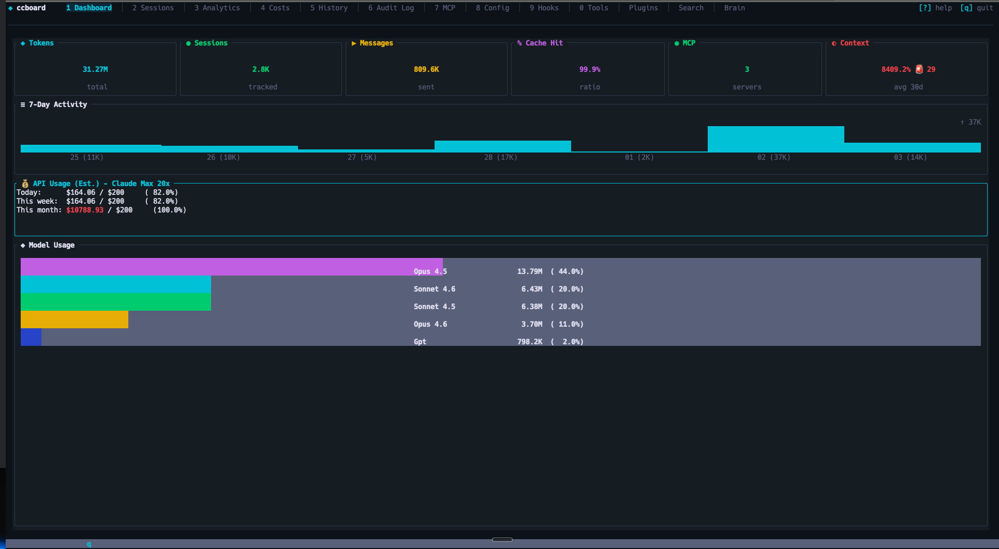

#### Sessions - Project Tree & Search
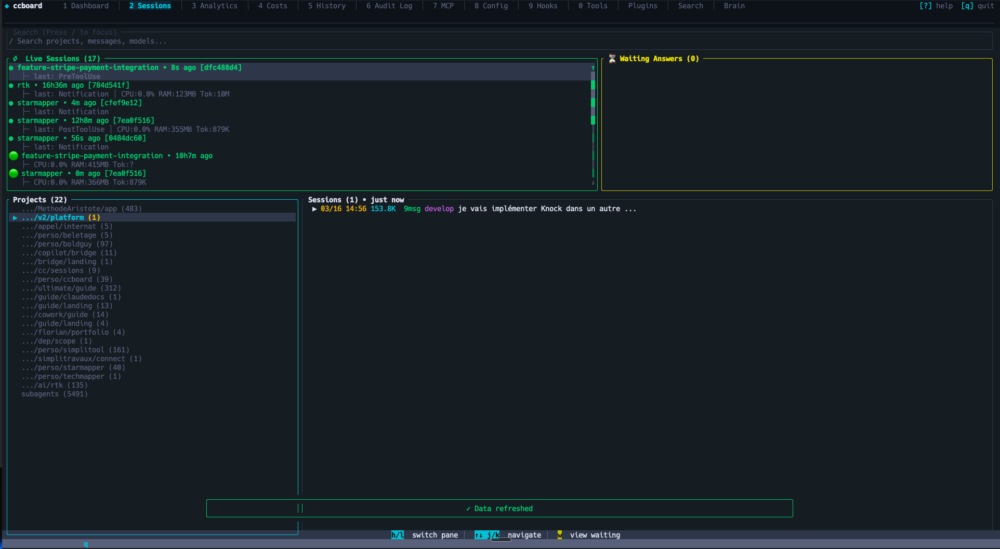

#### Sessions - Detail View
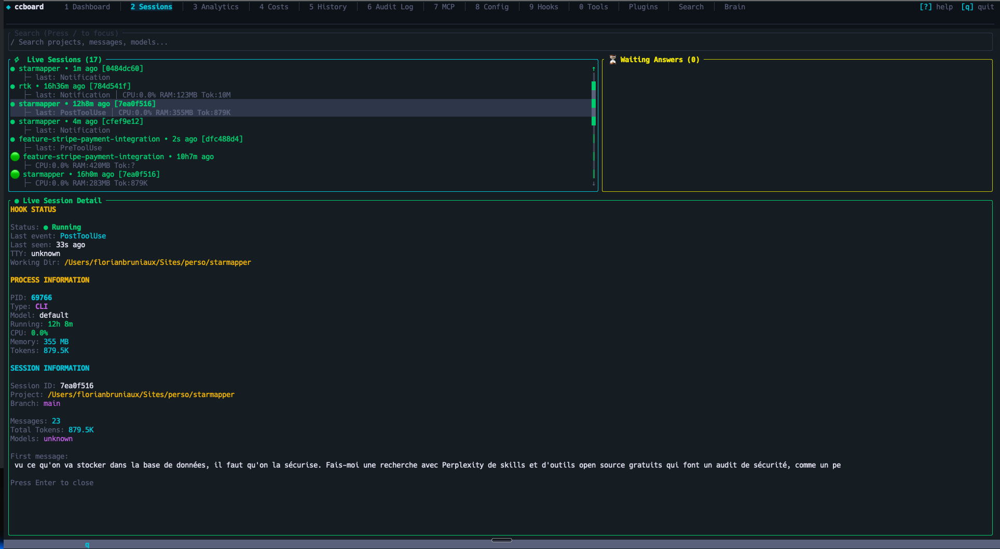

#### Sessions - Live Process Monitoring


<details>
<summary>More TUI Screenshots (click to expand)</summary>

#### Configuration - 4-Column Merge View
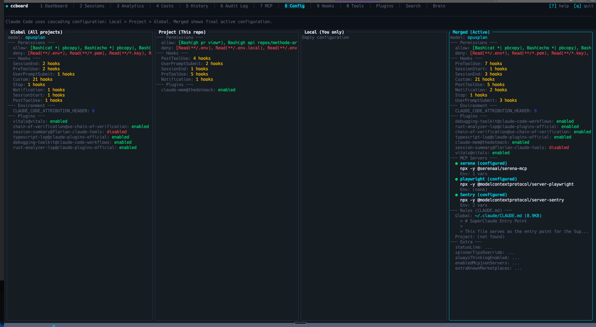

#### Hooks Management
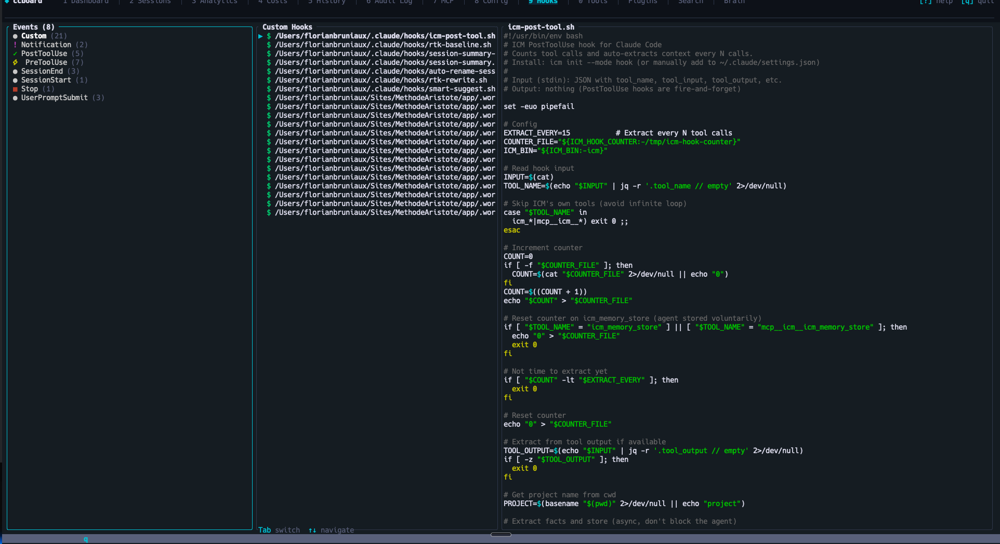

#### Agents, Commands & Skills
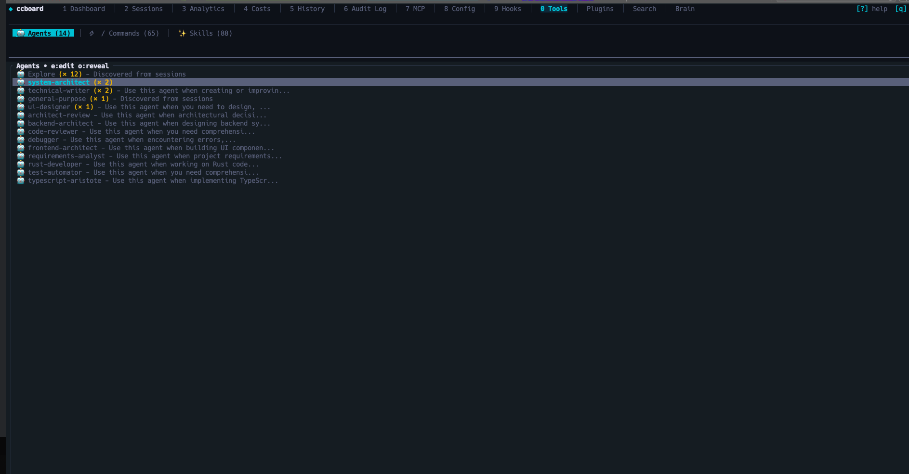
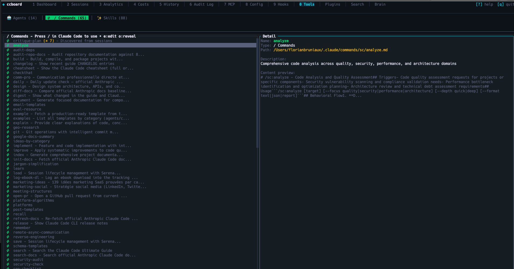
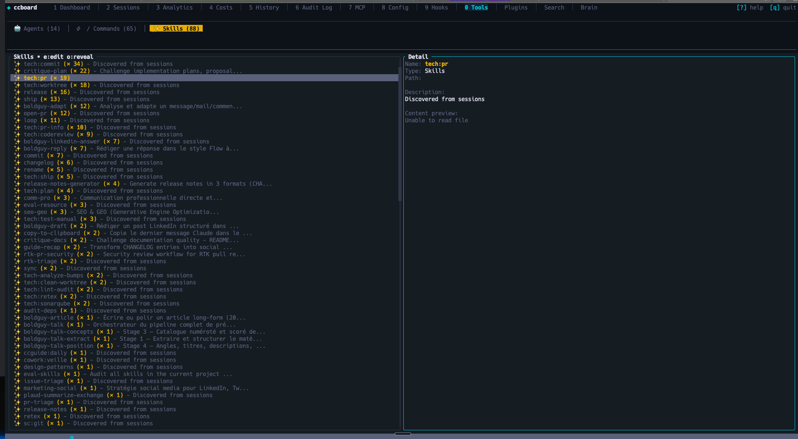

#### Cost Analytics
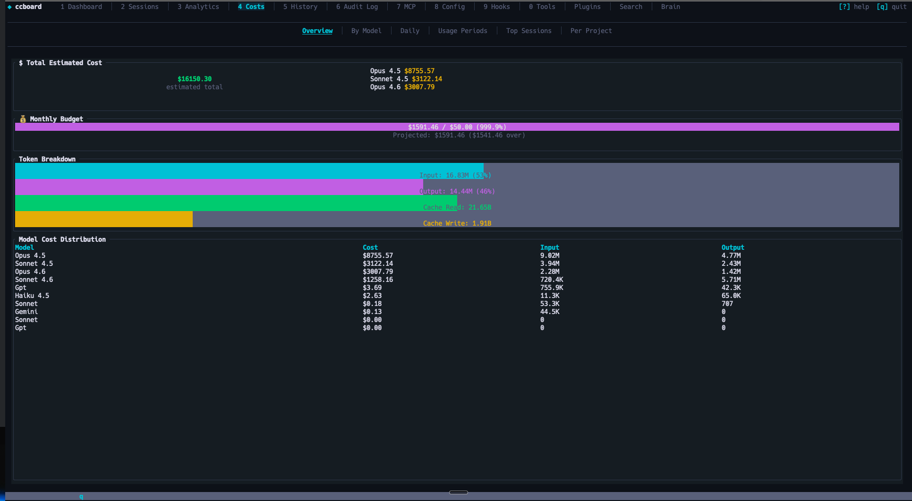
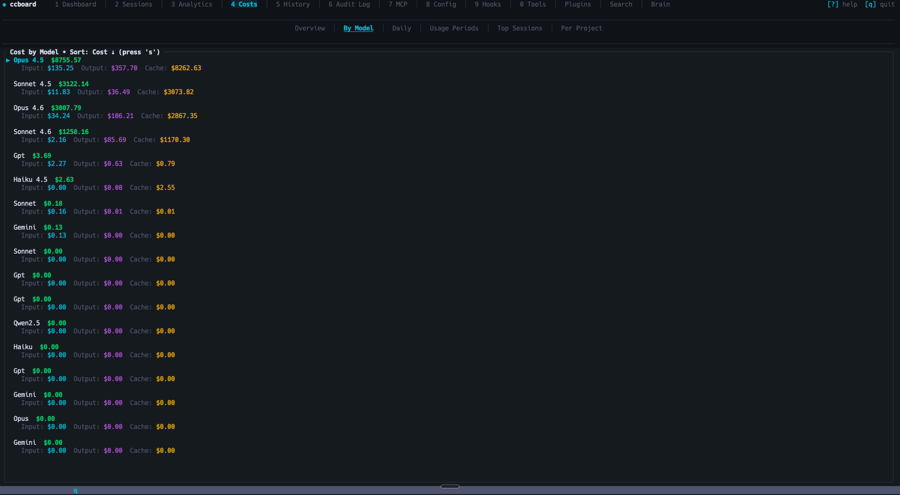
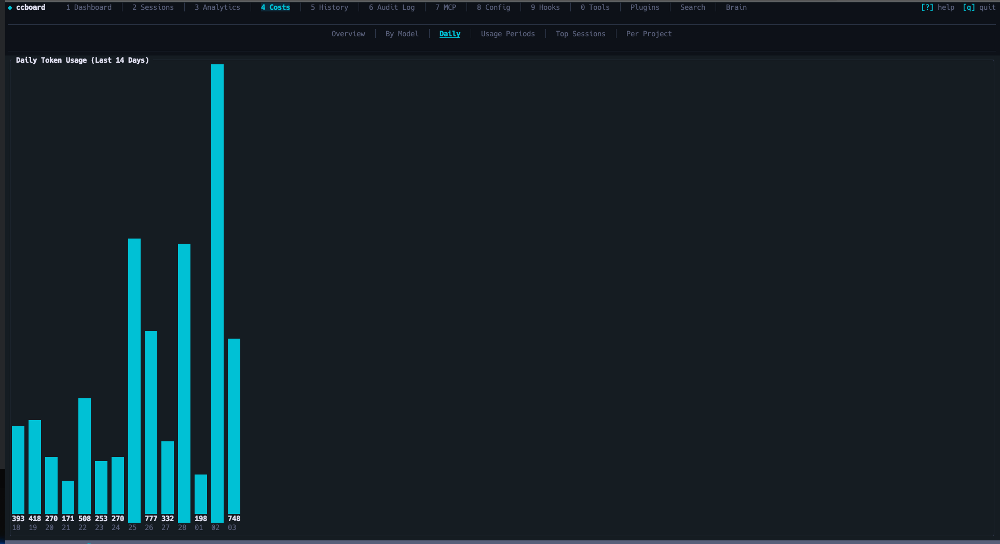
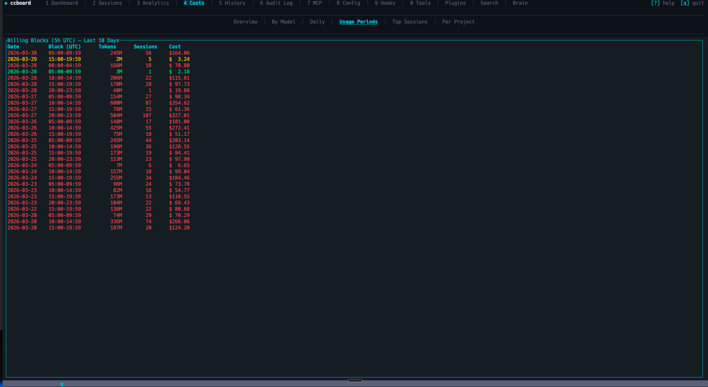


#### History Search
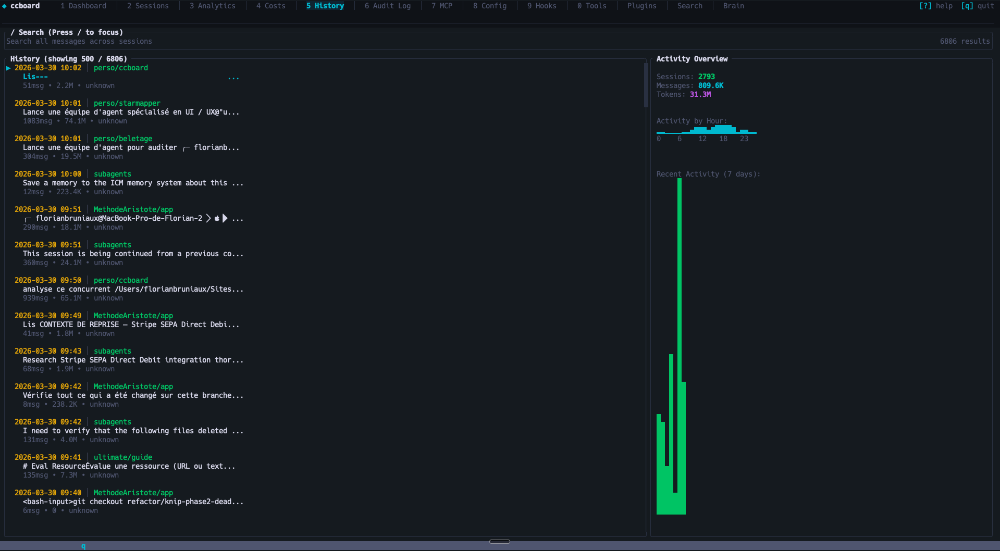

#### MCP Servers


#### Analytics
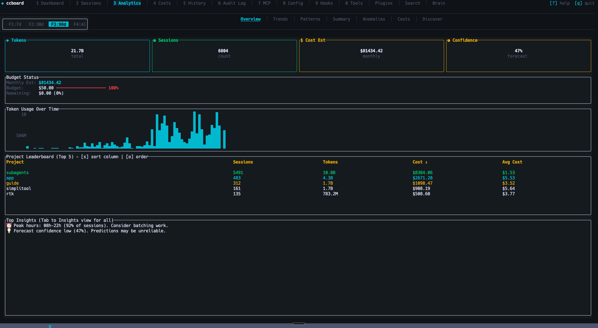
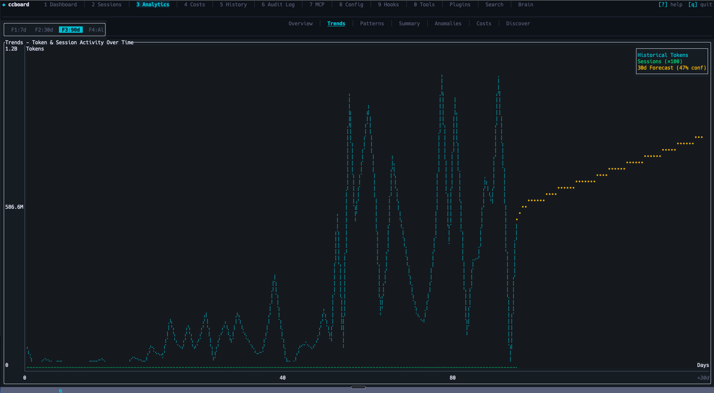
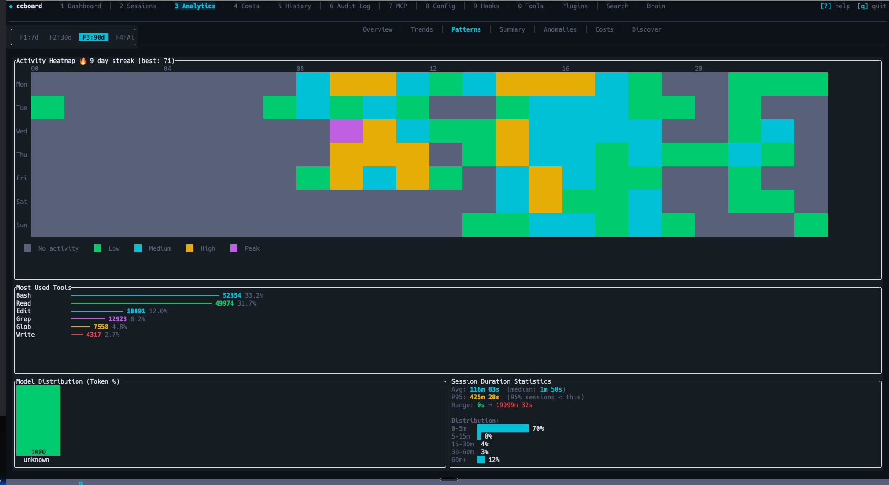

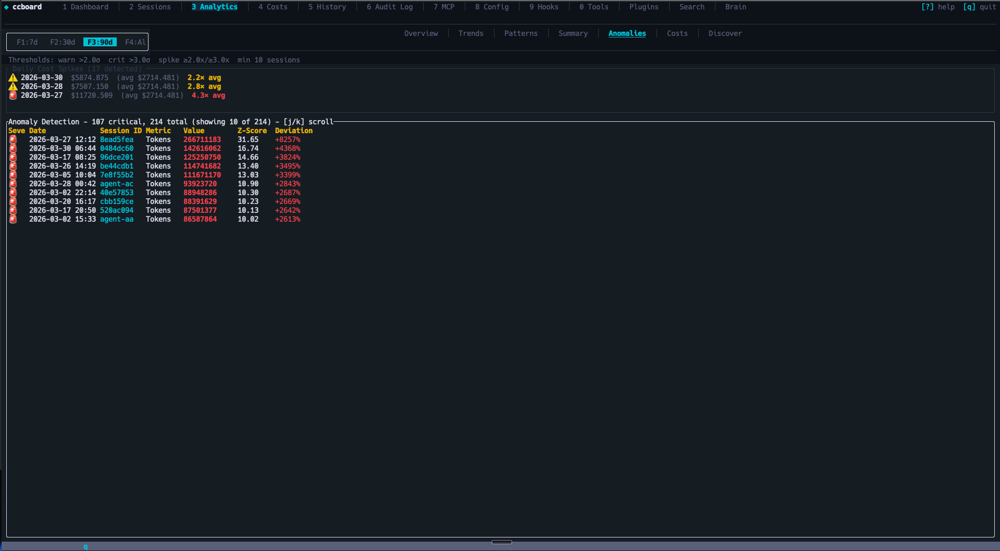

</details>

---

### Web Interface

#### Dashboard


#### Sessions - Browse & Live Monitoring


<details>
<summary>More Web Screenshots (click to expand)</summary>

#### Configuration


#### Hooks


#### Agents, Commands & Skills


#### Cost Analytics


#### History


#### MCP Servers


#### Analytics


</details>

---

## Why ccboard Exists

**Problem**: Claude Code has no built-in visualization/analysis tools beyond basic CLI commands (`/history`, `/stats`). Users are left scripting with `jq`, `grep`, or manually opening JSON files.

**Solution**: ccboard is the **only tool** dedicated to Claude Code monitoring and management:
- **Zero direct competitors** for Claude Code dashboard (verified 2026-02-04)
- **Not competing with LangSmith/W&B** (they trace LangChain API calls, not local Claude sessions)
- **Fills the gap** between CLI commands and full observability

### Unique Position

1. **All-local**: Reads `~/.claude` files, no SaaS/API required
2. **Unified Dashboard**: 9 tabs (config, hooks, agents, MCP, analytics) vs basic CLI
3. **Performance**: SQLite cache (89x speedup), handles 10K+ sessions
4. **Dual Interface**: TUI + Web in single 5.8MB binary

**Risk**: Anthropic could integrate dashboard into Claude Code CLI. But currently, nothing exists.

---

## Competitive Landscape

ccboard vs ccusage vs agtrace vs claudelytics — Claude Code monitoring tools compared (verified 2026-02-06):

| Feature | **ccboard** | agtrace | claudelytics | ccusage |
|---------|-------------|---------|--------------|---------|
| **Status** | ✅ Active | ✅ Active | 🔴 Stale 6m | ✅ Active |
| **Stars** | 0 | 23 | 62 | 10,361 |
| **Language** | Rust | Rust | Rust | TypeScript |
| **Type** | TUI+Web | TUI | TUI | CLI |
| | | | | |
| **TUI Dashboard** | ✅ 9 tabs | ✅ Single view | ✅ 8 tabs | ❌ |
| **Config Viewer (3-level merge)** | ✅ | ❌ | ❌ | ❌ |
| **Hooks Viewer + Test** | ✅ | ❌ | ❌ | ❌ |
| **Agents/Commands/Skills Browser** | ✅ | ❌ | ❌ | ❌ |
| **MCP Server Status Detection** | ✅ | ❌ | ❌ | ❌ |
| **SQLite Cache (89x speedup)** | ✅ | ✅ Pointer-based | ❌ | ❌ |
| **Export CSV/JSON** | ✅ | ❌ | ✅ | ✅ JSON |
| **Live File Watcher** | ✅ | ✅ Poll 1s | ❌ | ❌ |
| **Advanced Analytics (Forecast, Budget)** | ✅ 4 views | ❌ | ⚠️ Burn rate | ❌ |
| **Single Binary (no runtime)** | ✅ 5.8MB | ✅ Rust | ✅ Rust | ❌ npm |
| | | | | |
| **MCP Server Mode** | ⏳ Soon | ✅ 6 tools | ❌ | ❌ |
| **Billing Blocks (5h)** | ⏳ Soon | ❌ | ✅ | ❌ |
| **Conversation Viewer** | ⏳ Soon | ❌ | ✅ | ❌ |
| **Multi-provider** | ❌ | ✅ 3 providers | ❌ | ❌ |

**Unique to ccboard**:
- Only **multi-concern dashboard** (config + hooks + agents + MCP + analytics)
- Config 3-level merge viewer (global/project/local)
- Hooks syntax highlighting + test mode
- Agents/Commands/Skills browser with invocation stats
- MCP server **status** detection (vs agtrace = MCP server mode)
- SQLite metadata cache (89x faster startup)
- **Advanced Analytics**: 30-day forecasting, budget alerts, session duration stats, usage patterns
- Dual TUI + Web single binary

**References**:
- **agtrace** (23⭐): Observability-focused, MCP self-reflection (6 tools), multi-provider
- **claudelytics** (62⭐, STALE 6m): Feature-rich TUI (8 tabs, billing blocks, conversation viewer)
- **ccusage** (10K⭐): CLI cost tracker (reference for pricing, no dashboard)

**Complementary tools**:
- **[xlaude](https://github.com/Xuanwo/xlaude)** (171 ⭐): Git worktree manager for Claude sessions
  - **Complementarity**: xlaude focuses on workspace isolation (PTY sessions, branch management), ccboard on analytics/monitoring
  - **Performance comparison**: ccboard lazy loading 15x faster (4.8s vs 72s for 3000 sessions)
  - **Use cases**: Use xlaude for session isolation, ccboard for historical analysis and cost tracking
  - **Learnings applied**: Environment variables (QW1), message filtering (QW2), performance validation (QW3)

---

## Configuration

### API Usage Estimation

ccboard displays estimated API costs in the Dashboard with plan-based budget tracking. Configure your subscription plan to see accurate percentages and budget limits.

**Add to `~/.claude/settings.json`** (global) **or** `.claude/settings.json` (per-project):

```json
{
  "subscriptionPlan": "max20x"
}
```

**Available plans:**

| Plan | Subscription Cost | Config Value |
|------|-------------------|--------------|
| Claude Pro | $20/month | `"pro"` |
| Claude Max 5x | $50/month | `"max5x"` |
| Claude Max 20x | $200/month | `"max20x"` |
| API (Pay-as-you-go) | No fixed cost | `"api"` |

**Important**: Max plans have **rate limits** (requests/day), not fixed spending limits. The costs shown are subscription prices used as reference points for budget estimation.

**Dashboard display:**

```
┌─ 💰 API Usage (Est.) - Claude Max 20x ─┐
│ Today:      $ 2.45 / $200.00  (  1.2%)│
│ This week:  $ 8.12 / $200.00  (  4.1%)│
│ This month: $78.40 / $200.00  ( 39.2%)│
└──────────────────────────────────────────┘
```

**Color coding:**
- 🟢 **Green**: < 60% of monthly budget
- 🟡 **Yellow**: 60-80% of monthly budget
- 🔴 **Red**: > 80% of monthly budget

**Note**: This is a **local estimation** calculated from your billing blocks, not real-time API data. For actual limits, use `:usage` in Claude Code or the Anthropic dashboard.

### Budget Alerts & Tracking

Configure custom monthly budgets with automatic alerts in the **Analytics tab** (Tab 9 → Overview). Get visual warnings when approaching your spending limit.

**Add to `~/.claude/settings.json`** (global) **or** `.claude/settings.json` (per-project):

```json
{
  "budget": {
    "monthlyBudgetUsd": 50.0,
    "alertThresholdPct": 80.0
  }
}
```

**Configuration:**

| Field | Type | Description | Default |
|-------|------|-------------|---------|
| `monthlyBudgetUsd` | number | Your monthly spending limit in USD | Required |
| `alertThresholdPct` | number | Alert threshold percentage (0-100) | `80.0` |

**Analytics Overview display:**

```
┌─ Budget Status ─────────────────────────────┐
│ Monthly Est: $42.50                         │
│ Budget:      $50.00  ━━━━━━━━━━━━━━━━  85% │
│ Remaining:   $7.50 (15%)                    │
│                                              │
│ ⚠️  WARNING: Approaching budget limit (85%) │
│ 💡 TIP: Projected overage: $5.20 if trend…  │
└──────────────────────────────────────────────┘
```

**Visual indicators:**

- 🟢 **Green bar**: < 60% of budget (safe zone)
- 🟡 **Yellow bar**: 60-80% of budget (caution)
- 🔴 **Red bar + ⚠️**: ≥ 80% of budget (warning)

**Alert types:**

1. **Budget Warning**: Current cost approaching threshold
2. **Projected Overage**: Forecast predicts budget exceeded if trend continues
3. **Usage Spike**: Daily tokens > 2x average (anomaly detection)

**4-level priority** (higher overrides lower):
1. `~/.claude/settings.json` (global)
2. `~/.claude/settings.local.json` (global, not committed to git)
3. `.claude/settings.json` (project, committed)
4. `.claude/settings.local.json` (project, developer-specific)

**Example workflows:**

- **Solo developer**: Set global budget in `~/.claude/settings.json`
- **Team project**: Set team budget in `.claude/settings.json` (committed), override personally in `.claude/settings.local.json`
- **Multiple projects**: Different budgets per project in each `.claude/settings.json`

---

## Usage

### TUI Mode (Default)

```bash
ccboard              # Launch TUI dashboard
ccboard stats        # Print stats and exit
ccboard search "query"   # Search sessions
ccboard recent 10    # Show 10 most recent sessions
```

### Web Mode

ccboard has **2 web workflows** depending on your use case:

#### Option 1: Production (Single Command) ⭐ Recommended

**For**: Running the full stack (API + Frontend) in production or for general use.

```bash
# Step 1: Compile frontend once (run in ccboard repo root)
trunk build --release

# Step 2: Start server (serves API + static frontend)
ccboard web
```

**Output**:
```
⠋ Loading sessions and statistics...
✓ Ready in 2.34s (1,247 sessions loaded)

🌐 Backend API + Frontend: http://127.0.0.1:3333
   API endpoints:          http://127.0.0.1:3333/api/*
```

**Features**:
- ✅ Single process, single port
- ✅ Serves backend API (`/api/*`) + frontend static files
- ✅ Real-time data updates via Server-Sent Events (SSE)
- ❌ No hot reload (need `trunk build` + F5 after code changes)

**When to use**: Daily use, demos, production, or when you just want the web interface running.

---

#### Option 2: Development (Hot Reload) 🔧

**For**: Developing the frontend with automatic recompilation and browser refresh.

```bash
# Terminal 1: Start backend API
ccboard web --port 8080

# Terminal 2: Start frontend dev server (run in ccboard repo root)
trunk serve --port 3333
```

**Output Terminal 1**:
```
🌐 Backend API only:       http://127.0.0.1:8080/api/*
   💡 Run 'trunk build' to compile frontend
```

**Output Terminal 2**:
```
📦 Starting build...
✅ Success! App is being served at: http://127.0.0.1:3333
```

**Features**:
- ✅ Real-time data updates via SSE
- ✅ **Hot reload**: Frontend code changes auto-recompile and refresh browser
- ✅ Separate logs for backend and frontend
- ❌ Two terminals required

**When to use**: When developing the Leptos frontend (editing `crates/ccboard-web/src/**/*.rs`).

**Note**: `trunk serve` automatically proxies `/api/*` requests to `http://localhost:8080` via Trunk.toml config.

---

### Dual Mode (TUI + Web)

Run both TUI and web server simultaneously:

```bash
ccboard both --port 3333
```

- Web server runs in background
- TUI runs in foreground
- Shared DataStore (same data, live updates)
- Press `q` in TUI to exit both

### Web Pages

**Available Pages** (100% TUI parity) ✅:
- `/` - Dashboard with KPIs and forecast
- `/sessions` - Sessions browser with **live CPU/RAM monitoring** 🔥
- `/analytics` - Analytics with budget tracking
- `/config` - 4-column configuration viewer
- `/hooks` - Hooks with syntax highlighting
- `/mcp` - MCP servers with status
- `/agents` - Agents/Commands/Skills browser
- `/costs` - 4 tabs (Overview, By Model, Daily, Billing Blocks)
- `/history` - History search and filters

### Stats Only

```bash
# Print stats summary and exit
ccboard stats
```

**Output example:**
```
ccboard - Claude Code Statistics
================================

Total Tokens:     12.5M
  Input:          8.2M
  Output:         3.1M
  Cache Read:     890K
  Cache Write:    310K

Sessions:         2,340
Messages:         18,450
Cache Hit Ratio:  28.7%

Models:
  claude-sonnet-4.5: 9.8M tokens (in: 6.5M, out: 2.3M)
  claude-opus-4: 1.2M tokens (in: 800K, out: 400K)
```

---

## Keybindings & Shortcuts

### Keybindings

#### Global Navigation

| Key | Action |
|-----|--------|
| `q` | Quit application |
| `Tab` / `Shift+Tab` | Navigate tabs forward/backward |
| `1-9` | Jump to specific tab |
| `:` | Open command palette |
| `r` | Refresh data |
| `Esc` | Close popup / Go back |

#### List Navigation

| Key | Action |
|-----|--------|
| `j` / `↓` | Move down |
| `k` / `↑` | Move up |
| `h` / `←` | Move left / Collapse |
| `l` / `→` | Move right / Expand |
| `PgUp` / `PgDn` | Page up/down (10 items) |
| `Enter` | Show detail / Select |

#### File Operations

| Key | Action |
|-----|--------|
| `e` | Edit file in `$EDITOR` |
| `o` | Reveal file in file manager |

#### Tab-Specific

**Sessions**
- `/` - Search sessions
- `Enter` - Show session detail

**Config**
- `m` - Show MCP detail modal
- `e` - Edit config file (based on column focus)

**History**
- `/` - Full-text search across sessions

**Costs**
- `Tab` / `←` / `→` - Switch cost views (Overview/By Model/Daily)

### Environment Variables

ccboard supports environment variables for automation and CI/CD workflows:

| Variable | Description | Example |
|----------|-------------|---------|
| `CCBOARD_CLAUDE_HOME` | Override Claude home directory | `CCBOARD_CLAUDE_HOME=/custom/path ccboard stats` |
| `CCBOARD_NON_INTERACTIVE` | Disable interactive prompts (CI/CD mode) | `CCBOARD_NON_INTERACTIVE=1 ccboard stats` |
| `CCBOARD_FORMAT` | Force output format: `json` or `table` | `CCBOARD_FORMAT=json ccboard recent 10` |
| `CCBOARD_NO_COLOR` | Disable ANSI colors (log-friendly) | `CCBOARD_NO_COLOR=1 ccboard search "bug"` |

**Use cases**:

```bash
# CI/CD: JSON output without colors
CCBOARD_NON_INTERACTIVE=1 CCBOARD_NO_COLOR=1 CCBOARD_FORMAT=json ccboard stats

# Testing: Isolated configuration
CCBOARD_CLAUDE_HOME=/tmp/test-claude ccboard stats

# Automation: Pipe JSON to other tools
CCBOARD_FORMAT=json ccboard sessions search "error" | jq '.[] | .id'

# Log-friendly: No colors for file redirects
CCBOARD_NO_COLOR=1 ccboard recent 50 > sessions.log
```

### Command Palette

Press `:` to open the command palette with fuzzy matching:

```
:dashboard    → Jump to Dashboard tab
:sessions     → Jump to Sessions tab
:config       → Jump to Config tab
:mcp          → Jump to MCP tab
:quit         → Exit application
```

### File Editing

ccboard integrates with your configured editor:

1. Navigate to any file (agent, session, hook, config)
2. Press `e` to edit
3. Editor opens in terminal (terminal state preserved)
4. Changes detected automatically via file watcher

**Editor priority**: `$VISUAL` > `$EDITOR` > fallback (nano/notepad.exe)

---

## Troubleshooting

### "Stats not loading" or "No sessions found"

Run Claude Code at least once to generate `~/.claude` directory:

```bash
claude  # Or use Claude Code via IDE
```

Then relaunch ccboard.

### "WASM compilation failed" (Web mode)

Ensure trunk is installed:

```bash
cargo install trunk
trunk --version  # Should be 0.18+
```

Then rebuild:

```bash
cd ccboard-web
trunk build --release
```

### "Connection refused" (Web mode)

Check if backend port is in use:

```bash
lsof -i :8080  # macOS/Linux
netstat -ano | findstr :8080  # Windows
```

Change port if needed:

```bash
ccboard web --port 3333
```

### Linux: "File manager not opening"

Install xdg-utils:

```bash
sudo apt install xdg-utils  # Debian/Ubuntu
sudo dnf install xdg-utils  # Fedora
```

### Windows: Terminal rendering issues

Use Windows Terminal (not cmd.exe) for proper Unicode support:
- Download: [Windows Terminal](https://aka.ms/terminal)
- Braille spinners `⠋⠙⠹` render correctly in Windows Terminal

---

## Development

### Stack

```
ccboard/                     # Binary CLI entry point
├── ccboard-core/            # Data layer (parsers, models, store, watcher)
├── ccboard-tui/             # Ratatui frontend (9 tabs)
└── ccboard-web/             # Axum API backend + Leptos WASM frontend
```

**Dependency flow**: `ccboard` → `ccboard-tui` + `ccboard-web` → `ccboard-core`

**Core principles**: Single binary with dual frontends sharing a thread-safe `DataStore`. Graceful degradation (partial data if files corrupted/missing). SQLite metadata cache (89x speedup) with lazy content loading. Arc for sessions (50x memory reduction), parking_lot::RwLock for stats/settings.

For detailed architecture documentation, see [ARCHITECTURE.md](ARCHITECTURE.md).

### Prerequisites

- Rust 1.85+ (`rustup install stable`)
- Claude Code with `~/.claude` directory

### Build & Run

```bash
# Clone repository
git clone https://github.com/FlorianBruniaux/ccboard.git
cd ccboard

# Build all crates
cargo build --all

# Run TUI (default)
cargo run

# Run web interface
cargo run -- web --port 3333

# Run with debug logging
RUST_LOG=ccboard=debug cargo run
```

### Testing

```bash
# Run all tests (281 tests)
cargo test --all

# Run tests for specific crate
cargo test -p ccboard-core

# Run with logging
RUST_LOG=debug cargo test
```

### Quality Checks

```bash
# Format code (REQUIRED before commit)
cargo fmt --all

# Clippy (MUST pass with zero warnings)
cargo clippy --all-targets

# Pre-commit checklist
cargo fmt --all && cargo clippy --all-targets && cargo test --all
```

### Watch Mode

```bash
# Auto-rebuild TUI on changes
cargo watch -x 'run'

# Auto-rebuild web
cargo watch -x 'run -- web'
```

### Error Handling Standards

ccboard follows strict Rust error handling practices:

- **anyhow::Result** in binaries (`ccboard`, `ccboard-tui`, `ccboard-web`)
- **thiserror** for custom errors in `ccboard-core`
- **Always** use `.context("description")` with `?` operator
- **No unwrap()** in production code (tests only)
- **Graceful degradation**: Return `Option<T>` + populate `LoadReport`

### Contributing

Contributions welcome! See [CONTRIBUTING.md](CONTRIBUTING.md) for guidelines.

**Development workflow:**
1. Fork the repository
2. Create a feature branch (`git checkout -b feat/amazing-feature`)
3. Make changes with tests
4. Run quality checks (`cargo fmt && cargo clippy && cargo test`)
5. Commit with descriptive message
6. Push and open a Pull Request

---

## Roadmap & Documentation

**Current Status**: 🎉 **PRODUCTION-READY** (v0.5.0)

### Completed ✅

- ✅ **Infrastructure**: Stats parser, Settings merge, Session metadata, DataStore, SQLite cache (89x speedup)
- ✅ **TUI Dashboard**: 9 interactive tabs (Dashboard, Sessions, Config, Hooks, Agents, Costs, History, MCP, Analytics)
- ✅ **Web Frontend**: Full Leptos/WASM UI with 100% TUI parity (9 pages)
- ✅ **Live Monitoring**: CPU/RAM/Tokens tracking for active Claude processes
- ✅ **Cost Analytics**: 4 views (Overview, By Model, Daily, Billing Blocks) + budget alerts
- ✅ **Advanced Analytics**: 30-day forecasting, usage patterns, actionable insights

**Total**: 281 tests passing, 0 clippy warnings

### Coming Soon 🚧

**Conversation Viewer**
- Full JSONL content display with syntax highlighting
- Message navigation, search within conversations
- Export selected messages

**Plan-Aware Dashboard**
- PLAN.md parsing and visualization
- Task completion tracking
- Progress indicators

**MCP Server Mode**
- Expose ccboard data as MCP tools for Claude Code

For detailed roadmap, see [ROADMAP.md](claudedocs/ROADMAP.md) and [PLAN.md](claudedocs/PLAN.md).

### Documentation

| Document | Description |
|----------|-------------|
| [ARCHITECTURE.md](ARCHITECTURE.md) | Technical architecture, data flow, concurrency model |
| [CHANGELOG.md](CHANGELOG.md) | Version history with detailed change descriptions |
| [SECURITY.md](SECURITY.md) | Security policy, vulnerability reporting, best practices |
| [CROSS_PLATFORM.md](CROSS_PLATFORM.md) | Platform-specific considerations and validation |
| [CONTRIBUTING.md](CONTRIBUTING.md) | Development guidelines and contribution workflow |
| [API Documentation](docs/API.md) | REST API and SSE endpoints for Web UI |
| [Architecture Decision Records](docs/architecture/) | Key architectural decisions and their rationale |
| [PLAN.md](claudedocs/PLAN.md) | Development phases and post-mortems |

---

## License

Licensed under either of:

- Apache License, Version 2.0 ([LICENSE-APACHE](LICENSE-APACHE) or http://www.apache.org/licenses/LICENSE-2.0)
- MIT License ([LICENSE-MIT](LICENSE-MIT) or http://opensource.org/licenses/MIT)

at your option.

### Contribution

Unless you explicitly state otherwise, any contribution intentionally submitted for inclusion in the work by you, as defined in the Apache-2.0 license, shall be dual licensed as above, without any additional terms or conditions.

---

## Acknowledgments

This project was developed following Test-Driven Development (TDD) principles with guidance from Agent Academy.

**Co-Authored-By**: Claude Sonnet 4.5 <noreply@anthropic.com>

---

## Author

**Florian Bruniaux** - Independent Developer
🌐 [florian.bruniaux.com](https://florian.bruniaux.com/) | 💼 [LinkedIn](https://www.linkedin.com/in/florianbruniaux/) | 🐙 [GitHub](https://github.com/FlorianBruniaux)

---

## Links

### Project

- **Repository**: https://github.com/FlorianBruniaux/ccboard
- **Issues**: https://github.com/FlorianBruniaux/ccboard/issues
- **Releases**: https://github.com/FlorianBruniaux/ccboard/releases
- **Crates.io**: https://crates.io/crates/ccboard
- **Documentation**: [PLAN.md](claudedocs/PLAN.md) | [CHANGELOG.md](CHANGELOG.md)

### Related Projects

- **[RTK (Rust Token Killer)](https://github.com/FlorianBruniaux/rtk)** - CLI proxy for 60-90% token reduction on dev operations
- **[Claude Code Ultimate Guide](https://cc.bruniaux.com/)** - Comprehensive guide to Claude Code CLI
- **[ccbridge](https://ccbridge.bruniaux.com/)** - Claude Code bridge for team collaboration
- **[Cowork Guide](https://cowork.bruniaux.com/)** - Technical coworking patterns and practices

---

**Made with ❤️ for the Claude Code community**
